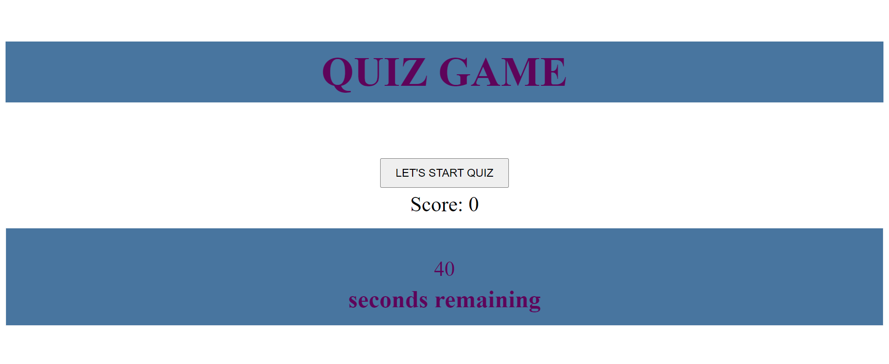

# 04 Web APIs: Code Quiz

## Description

For this challenge Challenge I built a timed coding quiz application with multiple-choice questions. It will run in the browser and will feature dynamically updated HTML and CSS powered by JavaScript code that you write. It will have a clean, polished, and responsive user interface. 


## Installation
In this challenge I have been using knowledge acquired in 04 Web-APIs Module of full stack development course.


## Acceptance Criteria

```
GIVEN I am taking a code quiz
WHEN I click the start button
THEN a timer starts and I am presented with a question
WHEN I answer a question
THEN I am presented with another question
WHEN I answer a question incorrectly
THEN time is subtracted from the clock
WHEN all questions are answered or the timer reaches 0
THEN the game is over
WHEN the game is over
THEN I can save my initials and my score

```

## Mock-Up

The following image shows the web application's appearance and functionality:



## Link to the live site

https://tatiana404.github.io/nice_simple_quiz/

## Credits

N/A

## License

MIT License